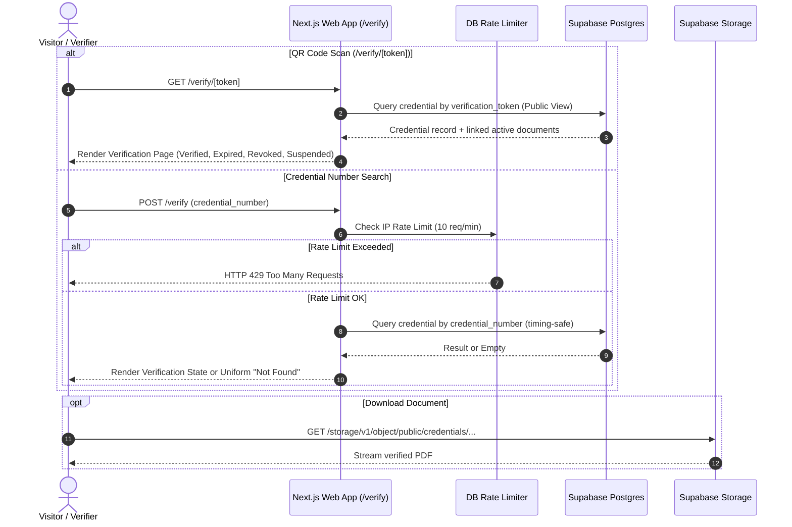
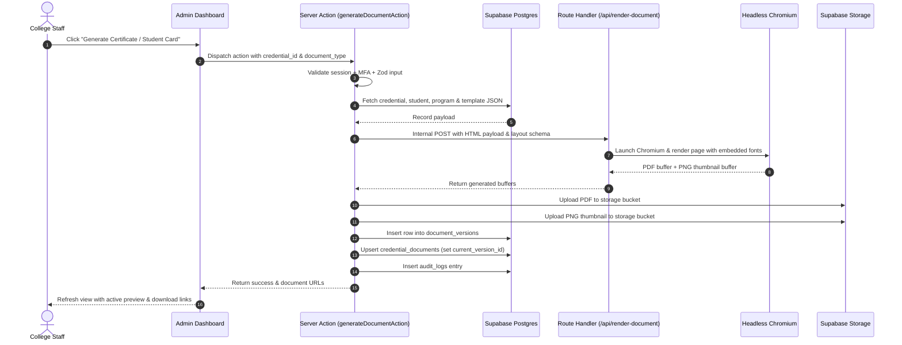

# ARCHITECTURE & SPECIFICATION — Cambria International College Platform

## 1. System Vision & Boundaries

The Cambria International College platform is a production-grade, unified web application delivering:
1. **Public Academic Portal**: Marketing, institutional information, curriculum catalog, and a public credential verification portal.
2. **Private Admin Dashboard (`/admin/*`)**: Strictly gated, MFA-enforced administrative interface for managing students, academic programs, credentials, document versions, and audit trails.
3. **Digital Credential Generation & Verification Engine**: High-fidelity PDF rendering engine for official Certificates and Student Identification Cards with cryptographic verification tokens and unified QR verification.

### Core Architectural Mandates
- **Single Next.js 15 Application**: Monolithic full-stack architecture using App Router, React Server Components (RSC), Server Actions, and Route Handlers. No external microservices, Express backends, or secondary runtimes.
- **Supabase Backend**: Supabase Postgres with strict Row Level Security (RLS) as default-deny, Supabase Auth (admin-only with TOTP MFA), and Supabase Storage for PDF and thumbnail persistence.
- **No Redis / No Message Queues**: All state, rate limiting, and audit logs are managed inside Postgres. Rate limiting uses a DB-backed sliding counter table.
- **No Obscurity / Defense in Depth**: `/admin/*` routes are protected by server-side middleware session checks, Server Action session validation, and database RLS.
- **Unified Credential Model**: One sequential credential number and one CSPRNG verification token shared across both certificate and student card documents issued under that credential.
- **Isolated Document Renderer**: Headless Chromium execution occurs within a dedicated Route Handler (`/api/render-document`) configured with extended `maxDuration`, isolating CPU/memory-intensive rendering from interactive server actions.

---

## 2. Request & Data Flow Diagrams

### 2.1 Public Verification Request Flow

### 2.2 Admin Document Generation & Versioning Flow

---

## 3. Security Architecture

1. **Authentication & Multi-Factor Auth (MFA)**:
   - Admin access only. No public sign-up or registration endpoints.
   - Admin accounts require Time-based One-Time Password (TOTP) MFA.
   - Sessions are cryptographically signed JWT cookies managed via `@supabase/ssr`.
2. **Authorization & Session Gating**:
   - Next.js middleware inspects every request to `/admin/*`. Unauthenticated requests redirect to `/admin/login`.
   - MFA check is enforced: accounts with MFA enrolled must complete the challenge before accessing admin routes.
   - Every Server Action re-validates the caller's session and authorization level server-side.
3. **Database Row Level Security (RLS)**:
   - `DEFAULT DENY` enabled on all tables: `students`, `programs`, `templates`, `credentials`, `credential_documents`, `document_versions`, `audit_logs`, `rate_limits`.
   - Anonymous access (`anon` role) is restricted to executing public verification lookups via dedicated database functions or view projections returning only non-sensitive columns (Student Name, Program Name, Credential Number, Dates, Status, Document download links).
   - Sensitive student fields (National ID, private phone, address) cannot be queried by the public anon role under any circumstance.
4. **Rate Limiting**:
   - Credential number lookup rate limiting: 10 requests per minute per IP address.
   - Admin login rate limiting: 5 failed attempts per 15 minutes per IP.
   - Handled via atomic PostgreSQL UPSERT operations in the `rate_limits` table.
5. **SEO & Crawling Controls**:
   - `robots.txt` disallows `/admin/` and `/verify/` lookup query routes.
   - Public marketing pages (`/`, `/about`, `/programs`, `/majors`, `/services`, `/team`, `/contact`) have full OpenGraph tags, semantic meta tags, and automated sitemap generation.

---

## 4. Document Rendering Pipeline Specification

1. **Architecture**:
   - Single unified rendering engine supporting both `certificate` (landscape, standard 1600x1131 or A4) and `student_card` (portrait, 600x900 or CR80 credit-card ratio).
   - JSON template schema defines dynamic overlays (text fields, dynamic badges, QR codes, issue dates) positioned precisely over a static background image.
2. **Typography & Arabic / RTL Support**:
   - Playwright / Chromium headless browser rendering ensures 100% accurate OpenType font shaping, ligatures, and bidirectional RTL rendering for Arabic text.
   - Web fonts (Cormorant Garamond, Inter, Cairo, Noto Naskh Arabic) are injected via `@font-face` rules with local base64 or bundled assets, eliminating dependency on host system fonts.
3. **QR Generation**:
   - QR code is generated server-side using standard `qrcode` library as SVG/PNG data URI.
   - QR payload is exclusively the canonical URL: `https://<domain>/verify/<verification_token>`.
4. **Dual Output Generation**:
   - Primary: Vector PDF document uploaded to storage.
   - Secondary: High-res PNG raster snapshot of page 1 uploaded as the thumbnail for instant admin list-view previews without PDF parsing.

---

## 5. Technology Stack Lock

| Component | Selected Technology | Rationale |
|---|---|---|
| **Framework** | Next.js 15 (App Router, Turbopack, React 19) | Full-stack server components, Server Actions, modern routing |
| **Language** | TypeScript 5 (Strict Mode) | Full type safety across DB schemas, actions, and renderers |
| **Styling** | Tailwind CSS + Radix UI / shadcn/ui primitives | Token-disciplined styling with customized radius (4-8px) and palette |
| **Database** | Supabase PostgreSQL + RLS | Native row-level security, relational integrity, ACID guarantees |
| **Authentication** | Supabase Auth + TOTP MFA | Secure cookie session management, built-in MFA support |
| **Storage** | Supabase Storage | S3-compatible asset store for certificates, cards, and thumbnails |
| **PDF Rendering** | Playwright / Chromium + `@sparticuz/chromium` | Flawless CSS grid/flex layout, embedded fonts, and Arabic text shaping |
| **QR Code Engine** | `qrcode` | Fast, dependency-free QR generation with custom error correction (Level M/Q) |
| **Input Validation** | Zod 3 | Runtime schema validation for all Server Actions and API payloads |
