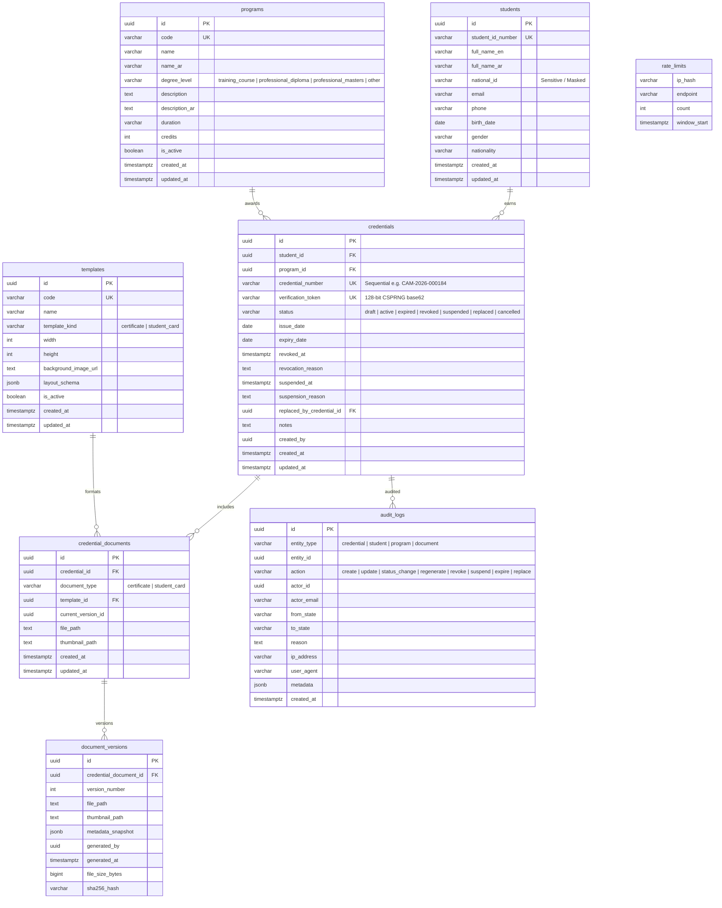

# DATA MODEL & DATABASE SCHEMA — Cambria International College Platform

## 1. Entity Relationship Diagram (ERD)



---

## 2. Relational Schema & Table Definitions (DDL)

```sql
-- Enable necessary extensions
CREATE EXTENSION IF NOT EXISTS "uuid-ossp";
CREATE EXTENSION IF NOT EXISTS "pgcrypto";

-- ============================================================================
-- 1. PROGRAMS TABLE
-- ============================================================================
CREATE TABLE public.programs (
    id UUID PRIMARY KEY DEFAULT gen_random_uuid(),
    code VARCHAR(50) NOT NULL UNIQUE,
    name VARCHAR(255) NOT NULL,
    name_ar VARCHAR(255) NOT NULL,
    degree_level VARCHAR(50) NOT NULL CHECK (degree_level IN ('training_course', 'professional_diploma', 'professional_masters', 'other')),
    description TEXT,
    description_ar TEXT,
    duration VARCHAR(100),
    credits INTEGER DEFAULT 0,
    is_active BOOLEAN NOT NULL DEFAULT true,
    created_at TIMESTAMPTZ NOT NULL DEFAULT now(),
    updated_at TIMESTAMPTZ NOT NULL DEFAULT now()
);

CREATE INDEX idx_programs_code ON public.programs(code);
CREATE INDEX idx_programs_active ON public.programs(is_active);

-- ============================================================================
-- 2. STUDENTS TABLE
-- ============================================================================
CREATE TABLE public.students (
    id UUID PRIMARY KEY DEFAULT gen_random_uuid(),
    student_id_number VARCHAR(50) NOT NULL UNIQUE,
    full_name_en VARCHAR(255) NOT NULL,
    full_name_ar VARCHAR(255) NOT NULL,
    national_id VARCHAR(100) NOT NULL, -- Sensitive column
    email VARCHAR(255) NOT NULL,
    phone VARCHAR(50),
    birth_date DATE,
    gender VARCHAR(20),
    nationality VARCHAR(100),
    created_at TIMESTAMPTZ NOT NULL DEFAULT now(),
    updated_at TIMESTAMPTZ NOT NULL DEFAULT now()
);

CREATE INDEX idx_students_id_number ON public.students(student_id_number);
CREATE INDEX idx_students_email ON public.students(email);
CREATE INDEX idx_students_names ON public.students(full_name_en, full_name_ar);

-- ============================================================================
-- 3. TEMPLATES TABLE
-- ============================================================================
CREATE TABLE public.templates (
    id UUID PRIMARY KEY DEFAULT gen_random_uuid(),
    code VARCHAR(50) NOT NULL UNIQUE,
    name VARCHAR(255) NOT NULL,
    template_kind VARCHAR(50) NOT NULL CHECK (template_kind IN ('certificate', 'student_card')),
    width INTEGER NOT NULL DEFAULT 1600,
    height INTEGER NOT NULL DEFAULT 1131,
    background_image_url TEXT,
    layout_schema JSONB NOT NULL DEFAULT '{"fields": []}'::jsonb,
    is_active BOOLEAN NOT NULL DEFAULT true,
    created_at TIMESTAMPTZ NOT NULL DEFAULT now(),
    updated_at TIMESTAMPTZ NOT NULL DEFAULT now()
);

CREATE INDEX idx_templates_code ON public.templates(code);
CREATE INDEX idx_templates_kind ON public.templates(template_kind);

-- ============================================================================
-- 4. CREDENTIALS TABLE
-- ============================================================================
CREATE TABLE public.credentials (
    id UUID PRIMARY KEY DEFAULT gen_random_uuid(),
    student_id UUID NOT NULL REFERENCES public.students(id) ON DELETE RESTRICT,
    program_id UUID NOT NULL REFERENCES public.programs(id) ON DELETE RESTRICT,
    credential_number VARCHAR(50) NOT NULL UNIQUE,
    verification_token VARCHAR(64) NOT NULL UNIQUE,
    status VARCHAR(30) NOT NULL DEFAULT 'draft' CHECK (status IN ('draft', 'active', 'expired', 'revoked', 'suspended', 'replaced', 'cancelled')),
    issue_date DATE NOT NULL DEFAULT CURRENT_DATE,
    expiry_date DATE,
    revoked_at TIMESTAMPTZ,
    revocation_reason TEXT,
    suspended_at TIMESTAMPTZ,
    suspension_reason TEXT,
    replaced_by_credential_id UUID REFERENCES public.credentials(id) ON DELETE SET NULL,
    notes TEXT,
    created_by UUID,
    created_at TIMESTAMPTZ NOT NULL DEFAULT now(),
    updated_at TIMESTAMPTZ NOT NULL DEFAULT now()
);

CREATE INDEX idx_credentials_number ON public.credentials(credential_number);
CREATE INDEX idx_credentials_token ON public.credentials(verification_token);
CREATE INDEX idx_credentials_student ON public.credentials(student_id);
CREATE INDEX idx_credentials_program ON public.credentials(program_id);
CREATE INDEX idx_credentials_status ON public.credentials(status);

-- ============================================================================
-- 5. CREDENTIAL_DOCUMENTS TABLE
-- ============================================================================
CREATE TABLE public.credential_documents (
    id UUID PRIMARY KEY DEFAULT gen_random_uuid(),
    credential_id UUID NOT NULL REFERENCES public.credentials(id) ON DELETE CASCADE,
    document_type VARCHAR(50) NOT NULL CHECK (document_type IN ('certificate', 'student_card')),
    template_id UUID NOT NULL REFERENCES public.templates(id) ON DELETE RESTRICT,
    current_version_id UUID, -- References document_versions(id) once version row created
    file_path TEXT,
    thumbnail_path TEXT,
    created_at TIMESTAMPTZ NOT NULL DEFAULT now(),
    updated_at TIMESTAMPTZ NOT NULL DEFAULT now(),
    CONSTRAINT uq_credential_document_type UNIQUE (credential_id, document_type)
);

CREATE INDEX idx_cred_docs_credential ON public.credential_documents(credential_id);
CREATE INDEX idx_cred_docs_type ON public.credential_documents(document_type);

-- ============================================================================
-- 6. DOCUMENT_VERSIONS TABLE
-- ============================================================================
CREATE TABLE public.document_versions (
    id UUID PRIMARY KEY DEFAULT gen_random_uuid(),
    credential_document_id UUID NOT NULL REFERENCES public.credential_documents(id) ON DELETE CASCADE,
    version_number INTEGER NOT NULL DEFAULT 1,
    file_path TEXT NOT NULL,
    thumbnail_path TEXT,
    metadata_snapshot JSONB NOT NULL DEFAULT '{}'::jsonb,
    generated_by UUID,
    generated_at TIMESTAMPTZ NOT NULL DEFAULT now(),
    file_size_bytes BIGINT,
    sha256_hash VARCHAR(64),
    CONSTRAINT uq_doc_version UNIQUE (credential_document_id, version_number)
);

CREATE INDEX idx_doc_versions_document ON public.document_versions(credential_document_id);
CREATE INDEX idx_doc_versions_generated ON public.document_versions(generated_at);

-- Foreign key linking credential_documents.current_version_id to document_versions(id)
ALTER TABLE public.credential_documents
    ADD CONSTRAINT fk_cred_doc_current_version
    FOREIGN KEY (current_version_id)
    REFERENCES public.document_versions(id)
    ON DELETE SET NULL;

-- ============================================================================
-- 7. AUDIT_LOGS TABLE
-- ============================================================================
CREATE TABLE public.audit_logs (
    id UUID PRIMARY KEY DEFAULT gen_random_uuid(),
    entity_type VARCHAR(50) NOT NULL,
    entity_id UUID NOT NULL,
    action VARCHAR(50) NOT NULL,
    actor_id UUID,
    actor_email VARCHAR(255),
    from_state VARCHAR(50),
    to_state VARCHAR(50),
    reason TEXT,
    ip_address VARCHAR(100),
    user_agent TEXT,
    metadata JSONB DEFAULT '{}'::jsonb,
    created_at TIMESTAMPTZ NOT NULL DEFAULT now()
);

CREATE INDEX idx_audit_logs_entity ON public.audit_logs(entity_type, entity_id);
CREATE INDEX idx_audit_logs_action ON public.audit_logs(action);
CREATE INDEX idx_audit_logs_created ON public.audit_logs(created_at DESC);

-- ============================================================================
-- 8. RATE_LIMITS TABLE
-- ============================================================================
CREATE TABLE public.rate_limits (
    ip_hash VARCHAR(64) NOT NULL,
    endpoint VARCHAR(100) NOT NULL,
    count INTEGER NOT NULL DEFAULT 1,
    window_start TIMESTAMPTZ NOT NULL DEFAULT now(),
    PRIMARY KEY (ip_hash, endpoint)
);

CREATE INDEX idx_rate_limits_window ON public.rate_limits(window_start);
```

---

## 3. Row Level Security (RLS) Policies

All tables have RLS enabled with `DEFAULT DENY`.

```sql
-- Enable RLS on all tables
ALTER TABLE public.programs ENABLE ROW LEVEL SECURITY;
ALTER TABLE public.students ENABLE ROW LEVEL SECURITY;
ALTER TABLE public.templates ENABLE ROW LEVEL SECURITY;
ALTER TABLE public.credentials ENABLE ROW LEVEL SECURITY;
ALTER TABLE public.credential_documents ENABLE ROW LEVEL SECURITY;
ALTER TABLE public.document_versions ENABLE ROW LEVEL SECURITY;
ALTER TABLE public.audit_logs ENABLE ROW LEVEL SECURITY;
ALTER TABLE public.rate_limits ENABLE ROW LEVEL SECURITY;

-- 1. PROGRAMS: Public read active programs, admin full access
CREATE POLICY "Public read active programs"
    ON public.programs FOR SELECT
    USING (is_active = true);

CREATE POLICY "Admin manage programs"
    ON public.programs FOR ALL
    TO authenticated
    USING (auth.role() = 'authenticated')
    WITH CHECK (auth.role() = 'authenticated');

-- 2. STUDENTS: Admin only. Public has ZERO read/write access.
CREATE POLICY "Admin manage students"
    ON public.students FOR ALL
    TO authenticated
    USING (auth.role() = 'authenticated')
    WITH CHECK (auth.role() = 'authenticated');

-- 3. TEMPLATES: Admin only. Public has no direct access.
CREATE POLICY "Admin manage templates"
    ON public.templates FOR ALL
    TO authenticated
    USING (auth.role() = 'authenticated')
    WITH CHECK (auth.role() = 'authenticated');

-- 4. CREDENTIALS: Public can verify via safe lookup function or restricted token query; Admin full access
CREATE POLICY "Admin manage credentials"
    ON public.credentials FOR ALL
    TO authenticated
    USING (auth.role() = 'authenticated')
    WITH CHECK (auth.role() = 'authenticated');

-- 5. CREDENTIAL_DOCUMENTS: Admin full access
CREATE POLICY "Admin manage credential documents"
    ON public.credential_documents FOR ALL
    TO authenticated
    USING (auth.role() = 'authenticated')
    WITH CHECK (auth.role() = 'authenticated');

-- 6. DOCUMENT_VERSIONS: Admin full access
CREATE POLICY "Admin manage document versions"
    ON public.document_versions FOR ALL
    TO authenticated
    USING (auth.role() = 'authenticated')
    WITH CHECK (auth.role() = 'authenticated');

-- 7. AUDIT_LOGS: Admin read only, server insert only
CREATE POLICY "Admin read audit logs"
    ON public.audit_logs FOR SELECT
    TO authenticated
    USING (auth.role() = 'authenticated');

-- 8. RATE_LIMITS: Server service-role only
```

---

## 4. Public Safe Verification Projections

To prevent exposing sensitive student data (such as `national_id` or private contact data) to the public verification endpoint, a secure database function `verify_credential_by_token` and `verify_credential_by_number` is provided:

```sql
CREATE OR REPLACE FUNCTION public.get_public_verification(lookup_token VARCHAR, lookup_number VARCHAR)
RETURNS JSONB
LANGUAGE plpgsql
SECURITY DEFINER
AS $$
DECLARE
    result JSONB;
BEGIN
    SELECT jsonb_build_object(
        'credential_number', c.credential_number,
        'verification_token', c.verification_token,
        'status', c.status,
        'issue_date', c.issue_date,
        'expiry_date', c.expiry_date,
        'student_name_en', s.full_name_en,
        'student_name_ar', s.full_name_ar,
        'program_name_en', p.name,
        'program_name_ar', p.name_ar,
        'degree_level', p.degree_level,
        'documents', (
            SELECT COALESCE(jsonb_agg(jsonb_build_object(
                'document_type', cd.document_type,
                'file_path', cd.file_path,
                'thumbnail_path', cd.thumbnail_path
            )), '[]'::jsonb)
            FROM public.credential_documents cd
            WHERE cd.credential_id = c.id
              AND cd.file_path IS NOT NULL
        )
    ) INTO result
    FROM public.credentials c
    JOIN public.students s ON s.id = c.student_id
    JOIN public.programs p ON p.id = c.program_id
    WHERE (lookup_token IS NOT NULL AND c.verification_token = lookup_token)
       OR (lookup_number IS NOT NULL AND c.credential_number = lookup_number)
    LIMIT 1;

    RETURN result;
END;
$$;
```

This guarantees that:
1. `national_id`, phone, email, and internal administrative notes are **never** selected or returned to public callers.
2. The verification payload returns identical metadata keys whether queried via QR token or credential number.
