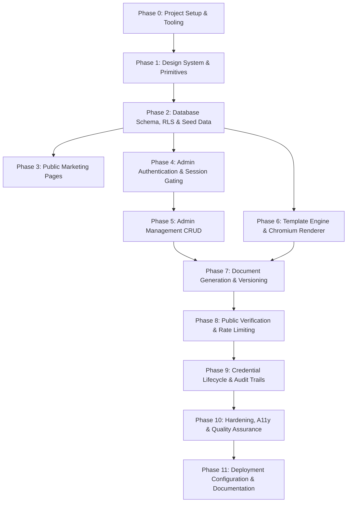

# PROJECT IMPLEMENTATION PLAN — Cambria International College Platform

This plan lays out the complete numbered milestones for building the Cambria International College Platform. Each phase has strict scope, explicit dependencies, concrete deliverables, and acceptance criteria.

---

## Milestone Overview

---

## Phase 0: Project Setup & Hygiene
- **Scope**: Initialize repository with Next.js 15, TypeScript (strict mode), Tailwind CSS, ESLint, Lucide icons, Supabase SDKs (`@supabase/supabase-js`, `@supabase/ssr`), Zod, and Playwright.
- **Dependencies**: None.
- **Tasks**:
  1. Initialize Next.js 15 App Router project in the root directory.
  2. Configure `tsconfig.json` with strict type checking and `@/*` path alias.
  3. Install core dependencies: `@supabase/supabase-js`, `@supabase/ssr`, `zod`, `qrcode`, `lucide-react`, `clsx`, `tailwind-merge`, `playwright`.
  4. Create `.env.example` with standard Supabase, app URL, and environment variables.
  5. Setup repository hygiene files (`.gitignore`, base `README.md`).
- **Acceptance Gate**: `npm run build` succeeds with zero errors.

---

## Phase 1: Design System, Tokens & Base Primitives
- **Scope**: Implement Cambria institutional design tokens (§10) in Tailwind and CSS variables, override shadcn/ui defaults (4–8px radius, border-first shadows), and create reusable UI primitives.
- **Dependencies**: Phase 0.
- **Tasks**:
  1. Configure `globals.css` with CSS variables for Primary Navy (`#020B5A`), Deep Navy (`#07133F`), Academic Blue (`#243A8F`), Soft Blue (`#EAF0FF`), Off-White (`#F8F9FC`), Gold Accent (`#C8A84E`), and border radius (4-8px).
  2. Configure typography in `next/font/google`: Cormorant Garamond for headings, Inter for body and UI.
  3. Build Cambria Institutional Seal vector SVG component (`<CambriaSeal />`) with open book, sunburst, quill, laurel, and 3 stars.
  4. Create core UI layout primitives: `<Container />`, `<Section />`, `<DoubleRingDivider />`, `<GoldStar />`, `<StatusBadge />`, `<PageHeader />`.
  5. Create base form controls (Button, Input, Select, Badge, Card, Dialog) strictly adhering to the 4-8px radius ceiling.
- **Acceptance Gate**: Visual token gallery or layout test renders clean typography, navy/gold palette, and double-ring divider.

---

## Phase 2: Database Schema, RLS & Seed Data
- **Scope**: Implement the complete relational schema from `DATA_MODEL.md` in SQL migrations, configure strict RLS policies, and build an automated database client and seed script.
- **Dependencies**: Phase 0.
- **Tasks**:
  1. Create SQL migration `001_initial_schema.sql` covering `programs`, `students`, `templates`, `credentials`, `credential_documents`, `document_versions`, `audit_logs`, `rate_limits`.
  2. Implement RLS policies (Default Deny, public verification projection, admin service access).
  3. Create Supabase client singletons for Server Components, Server Actions, and Browser Components.
  4. Implement database seeding script `scripts/seed.ts` populating:
     - 4 realistic programs (Training Courses, Professional Diplomas, Master's).
     - 5 realistic synthetic students with English and Arabic names.
     - 1 Certificate template layout and 1 Student ID Card template layout.
     - 4 credentials spanning lifecycle states (Active, Expired, Revoked, Suspended).
- **Acceptance Gate**: Migrations and seed script execute cleanly; RLS default-deny verified.

---

## Phase 3: Public Marketing Pages
- **Scope**: Build the complete responsive public website matching Cambria's editorial identity (§11).
- **Dependencies**: Phase 1, Phase 2.
- **Tasks**:
  1. Build global Navigation (`<Navbar />`) with Cambria seal, navigation links, and "Verify Credential" CTA.
  2. Build global Institutional Footer (`<Footer />`) on Deep Navy (`#07133F`) with white logo, legal disclosures, and sitemap.
  3. Implement **Home Page** (`/`): Editorial hero with Cormorant Garamond display typography, seal watermark, value pillars, and program preview.
  4. Implement **About Page** (`/about`): History, academic governance, mission, and accreditation notice.
  5. Implement **Programs Page** (`/programs`): Numbered editorial catalog layout (`01.`, `02.`, etc.) for Training, Diplomas, and Master's.
  6. Implement **Majors Page** (`/majors`): Academic disciplines and degree levels.
  7. Implement **Services Page** (`/services`): Editorial numbered services (Credential evaluation, transcript verification).
  8. Implement **Team Page** (`/team`): Leadership and Academic Council directory with honest "Content Pending" markers where real bios are awaited.
  9. Implement **Contact Page** (`/contact`): Official registrar contact form and international liaison offices.
- **Acceptance Gate**: All pages render cleanly, mobile responsive from 320px to 1920px, zero stock photos, zero broken links.

---

## Phase 4: Admin Authentication & Session Gating
- **Scope**: Secure `/admin/*` with Supabase Auth, TOTP MFA challenge, and session middleware.
- **Dependencies**: Phase 0, Phase 2.
- **Tasks**:
  1. Implement Next.js Middleware (`middleware.ts`) enforcing authenticated sessions on `/admin/*` (excluding `/admin/login`).
  2. Build Admin Login Page (`/admin/login`) with rate-limiting feedback and email/password inputs.
  3. Implement Server Action `loginAction` using Supabase Auth.
  4. Build MFA verification flow (`/admin/mfa/verify`) for TOTP challenge.
  5. Implement `logoutAction` and session invalidation.
- **Acceptance Gate**: Unauthenticated visit to `/admin` redirects to `/admin/login`; valid login grants access to the dashboard.

---

## Phase 5: Admin Management CRUD
- **Scope**: Build management interfaces for Students, Programs, and Credentials with Zod-validated Server Actions.
- **Dependencies**: Phase 2, Phase 4.
- **Tasks**:
  1. Build Admin Shell layout (`/admin/layout.tsx`) with sidebar navigation, staff user profile, and quick actions.
  2. Build **Dashboard Overview** (`/admin/page.tsx`): Metric cards, recent issuances, status distribution chart.
  3. Build **Students Management** (`/admin/students`): List with search, student creation modal, and student detail view (`/admin/students/[id]`) with masked National ID.
  4. Build **Programs Management** (`/admin/programs`): Program list and creation form with bilingual titles.
  5. Build **Credentials Management** (`/admin/credentials`): Filterable credentials table (by status and program), creation wizard (select student, program, issue/expiry dates).
- **Acceptance Gate**: Staff can create a student, create a program, and issue a credential through the admin UI.

---

## Phase 6: Template Engine & Chromium PDF Renderer
- **Scope**: Implement the JSON template layout engine, one certificate template, one student card template, and the isolated Chromium rendering Route Handler.
- **Dependencies**: Phase 1, Phase 2.
- **Tasks**:
  1. Define TypeScript types for template schema (`TemplateLayout`, `TemplateField`).
  2. Implement standard Certificate template JSON (Landscape 1600x1131, elegant border, seal, student name, program, credential number, QR code).
  3. Implement standard Student Card template JSON (Portrait CR80 600x900, photo box, barcode/QR, student ID, program, expiry).
  4. Build Route Handler `/api/render-document` using Playwright / Chromium:
     - Injects HTML with embedded `@font-face` fonts for English and Arabic.
     - Positions dynamic overlay fields.
     - Generates vector PDF buffer and raster PNG thumbnail buffer.
- **Acceptance Gate**: POST to `/api/render-document` generates a verified vector PDF and matching PNG thumbnail with correctly rendered Arabic text.

---

## Phase 7: Document Generation Flow & Versioning
- **Scope**: Wire Admin "Generate Document" actions to the rendering pipeline, save artifacts to Supabase Storage, and implement immutable versioning.
- **Dependencies**: Phase 5, Phase 6.
- **Tasks**:
  1. Implement Server Action `generateDocumentAction(credentialId, documentType)`.
  2. Verify that **both** certificate and student card share the exact same `credential_number` and `verification_token` from the parent credential.
  3. Upload rendered PDF and PNG thumbnail to Supabase Storage.
  4. Insert record into `document_versions` and update `credential_documents.current_version_id`.
  5. Test regeneration flow: changing student details or reissuing increments `version_number` while preserving the credential number and QR token.
- **Acceptance Gate**: Admin can generate both certificate and card for a credential; both display the same credential number and QR code; re-generating creates version 2 without altering the QR token.

---

## Phase 8: Public Verification & Rate Limiting
- **Scope**: Build public verification portal (`/verify` and `/verify/[token]`), showing current lifecycle state and document downloads, with IP rate limiting.
- **Dependencies**: Phase 2, Phase 7.
- **Tasks**:
  1. Implement IP-based sliding window rate limiter in `src/lib/rate-limit.ts` using `rate_limits` table.
  2. Build `/verify` landing page with signature Deep Navy styling, credential search input, and verification instructions.
  3. Build `/verify/[token]` resolution page displaying non-sensitive fields (Holder Name, Program, Credential #, Issue/Expiry, Status, Document download links).
  4. Handle all lifecycle states: **Active/Verified**, **Expired**, **Revoked**, **Suspended**, and uniform **Not Found**.
  5. Ensure rate-limiting triggers HTTP 429 after 10 searches per minute.
- **Acceptance Gate**: QR code scan opens `/verify/[token]`, displays correct status, and allows downloading the current active PDF.

---

## Phase 9: Lifecycle State Machine & Audit Trail
- **Scope**: Implement credential status transitions in the admin UI, enforce state rules, and record every change in `audit_logs`.
- **Dependencies**: Phase 5, Phase 7, Phase 8.
- **Tasks**:
  1. Implement state transition machine: `DRAFT -> ACTIVE -> EXPIRED | REVOKED | SUSPENDED | REPLACED` (with `CANCELLED` from `DRAFT`).
  2. Build Status Change dialog in Admin Credential detail view requiring a mandatory textual reason.
  3. Write transition details to `audit_logs` (actor, from_state, to_state, reason, timestamp, IP).
  4. Build `/admin/audit-logs` viewer to inspect system activity.
  5. Verify that revoking or suspending immediately changes the public verification badge on `/verify/[token]`.
- **Acceptance Gate**: Revoking a credential in admin requires a reason, writes an audit row, and immediately renders the "Revoked" red badge on the public verification page.

---

## Phase 10: Hardening, A11y & Quality Assurance
- **Scope**: Production readiness audit across accessibility, responsive breakpoints, RLS security, and edge cases.
- **Dependencies**: All preceding phases.
- **Tasks**:
  1. RLS Security Audit: verify anonymous queries to sensitive student columns or admin tables return zero rows.
  2. WCAG 2.1 AA audit: contrast ratios (4.5:1), visible focus outlines, keyboard navigation, accessible form labels.
  3. Responsive QA across 320px, 768px, 1024px, 1440px, 1920px.
  4. Verify Arabic/RTL text rendering in both UI and generated PDF outputs.
  5. Verify timing-safe responses on credential number searches.
- **Acceptance Gate**: 100% of Definition of Done criteria met; no console errors; all flows functional.

---

## Phase 11: Deployment Configuration & Documentation
- **Scope**: Finalize production configuration, environment documentation, and top-level README.
- **Dependencies**: Phase 10.
- **Tasks**:
  1. Configure `next.config.ts` for production (image domains, headers, security policies).
  2. Verify `robots.txt` and `sitemap.ts` rules.
  3. Write root `README.md` with complete installation, local migration, seed data, and run instructions.
  4. Final update to `/docs/PROGRESS.md` confirming full completion.
- **Acceptance Gate**: `npm run build` passes with zero errors and clean output.

---

## Phase 12: Reference-Site Structural Translation & Editorial Enhancement
- **Scope**: Translate selected structural/UX ideas from the benchmark reference site into Cambria's locked brand identity without stock photos, fabricated stats, or unapproved card grids.
- **Dependencies**: Phase 3, Phase 10.
- **Tasks**:
  1. Build subtle headline tagline rotation component (`<TaglineRotator />`) for editorial hero crossfade.
  2. Implement three-point value strip (`<ValueStrip />`) in Off-White / Soft Blue with circular icon framing.
  3. Implement editorial welcome overlap card (`<EditorialWelcomeCard />`) with thin gold left border and Cormorant Garamond typography.
  4. Build full-width Deep Navy "Why Cambria" stat band (`<InstitutionalStatBand />`) with honest verified metrics only.
  5. Implement circular composite achievement visual (`<AchievementVisual />`) with concentric double-ring framing and gold star accent.
  6. Build editorial quote cards (`<QuoteCard />`) with gold quotation glyphs and strict attribution rules.
  7. Apply consistent restrained animation layer (`fade-up`, `line-expand`, `hover-arrow`) across all public pages.
  8. Log open architectural questions in `docs/DECISIONS.md` and content dependencies in `docs/CONTENT_NEEDED.md`.
- **Acceptance Gate**: Zero reference-site red colors or photo-card patterns leaked in; zero fabricated figures; clean build (`npm run build`).
